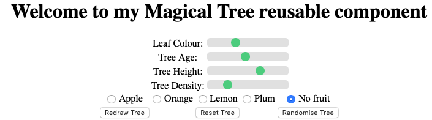
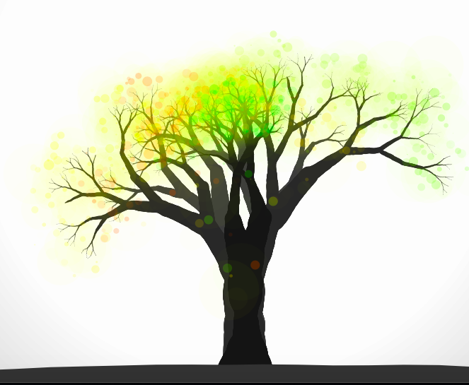
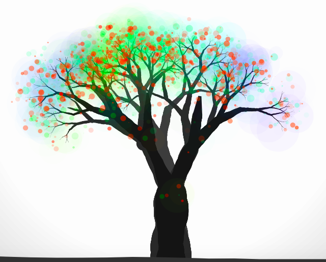
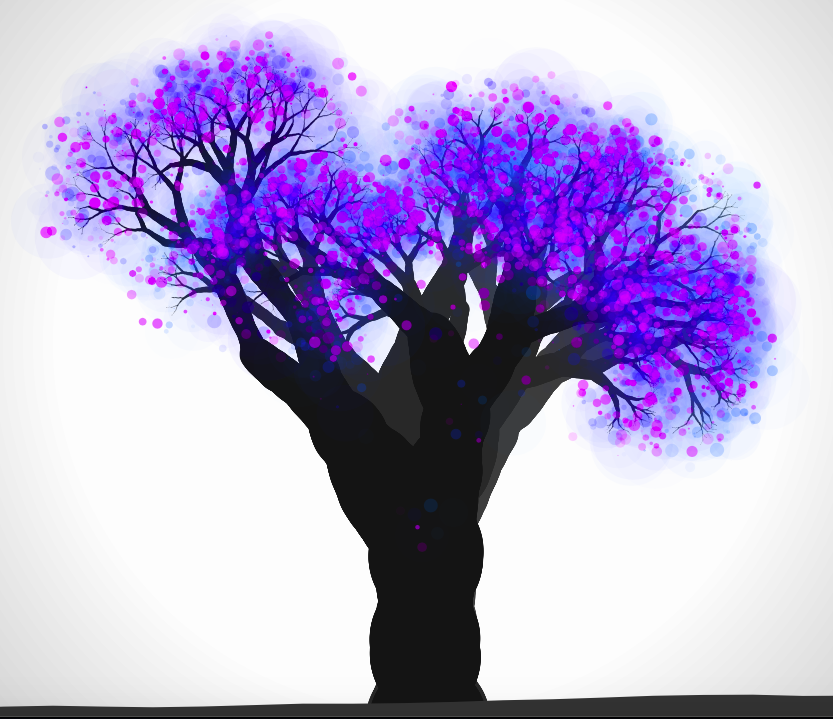
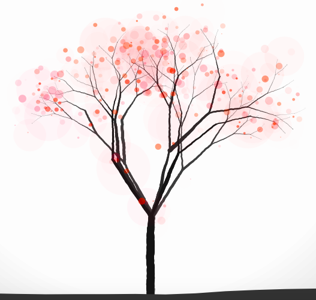

# Documentation of the Magical Tree reusable compent:

## first section:
eplanation of each class and their relavent methods and parameters

### list of classes:
1. clMagicalTree
1. clCreateTree
1. clDrawLeaves
1. clGround
1. clTreeBackground

### clMagicalTree

The MagicalTree class is the master class of this reusable compoent, its purpose is to control how the sketch displays. Defined within it the necessary objects to display the tree, and allow for the optional p5 renderer to be used.
The MagicalTree class begins with its contructor, shown below:

    constructor() {
        this.objBg = new clTreeBackground();
        this.objTree = new clCreateTree();
        this.objGround = new clGround();
        this.objLeaf = new clDrawLeaves();
        this.objFruit = new clDrawLeaves();
    }
 
The constructor takes no parameters however creates 5 attributes, which are objects for each of the different parts of the tree. objBg is the background object which display behind the tree.
objTree is the object that is instansiated from the createTree class, which generates the tree.
objGround is the object of the ground that the tree is rooted in, and there are two instances of the clDrawLeaves class, which are for the leaves of the tree (objLeaf) and the fruit of the tree (objFruit).

The draw method within the MagicalTree class is shown below:

    draw(g) {
        //checks if g exists to pass variable
        colorMode(HSB);
        noLoop();
        if (g) {
        this.buildBg(g);
        this.buildTree(g);
        this.buildGround(g);
        this.buildLeaf(g);
        } else {
        this.buildBg();
        this.buildTree();
        this.buildGround();
        this.buildLeaf();
        }
      }

This method has an optional parameter g which allows for the tree and all components to be drawn on a an object or as a texture. The if statement checks if this parameter is present and then calls the individual build methods of the tree component objects.

So that this component can be flexable to the user, several build methods are used, meaning that the user does not have to include all the aspects of the magical tree, for example choosing to call all build methods but the background, or ground. The build methods are shown below and include a chec for the optional renderer argument g.

    buildTree(g) {
        if (g) {
          this.objTree.draw(g);
          this.objLeaf.setLeafArray(this.objTree.leafArray);
        } else {
          this.objTree.draw();
          this.objLeaf.setLeafArray(this.objTree.leafArray);
        }
    }

      //draws ground for tree
      buildGround(g) {
        if (g) {
          this.objGround.draw(g);
      
        } else {
          this.objGround.draw();
        }
      }

      //draws tree background
      buildBg(g) {
        if (g) {
          this.objBg.draw(g);
        } else {
          this.objBg.draw();
        }

      }

      //draws leves on tree
      buildLeaf(g) {
        if (g) {
          this.objLeaf.draw(g);
        } else {
          this.objLeaf.draw();
        }

      }
      
The MagicalTree class has a series of getters and setters for all aspects of the tree customisation. To modify the color of the trees leaves, the setLeafColor method can be called, shown below, which takes an integer as a color and runs the relivent setters within the objLeaf.

      setLeafColor(argColor, radix) {
        var minColor = parseInt(argColor, radix) - 15;
        var maxColor = parseInt(argColor, radix) + 15;
        this.objLeaf.changeColor(minColor, maxColor);
      }
The minColor and maxColor is to add a slight range in the leaves color, which gives a more natural and asthetic look.

Similarly to the setLeafColor, there is a setter to change the fruits color, which again takes a integer parameter:

    setFruitColor(argColor, radix) {
        var minColor = parseInt(argColor, radix) - 5;
        var maxColor = parseInt(argColor, radix) + 5;
        if (argColor !== this.objFruit.getColor()) {
          this.redraw();
        }
          this.objFruit.changeColor(minColor, maxColor);
          this.redraw();
      }
An if statement checks if the current color of the fruit is the same as the new color, if so it doesnt redraw the tree.

The addFruit method shown below, takes a frit name as a parameter (in string form), and then uses a switch statement to find the assosiated HSB color.

//method for adding fruit to tree
  addFruit(argFruit) {

    this.objFruit.setLeafArray(this.objTree.leafArray);
      switch (argFruit) {

        case "apple":
          this.setFruitColor(10);
          break;

        case "orange":
          this.setFruitColor(33);
          break;

        case "lemon":
          this.setFruitColor(60);
          break;

        case "plum":
          this.setFruitColor(285);
          break;

        case "no fruit":
          this.objFruit.deleteLeaf();

      }
      //if no fruit has been seletced, redraws tree
      if (argFruit === "no fruit") {
        this.redraw();
      } else {

        this.objFruit.drawFruit();
      }

    }
    
The if statement above checks if the "no fruit" option was passed as an argument, if so the tree is redrawn, otherwise the new fruit is added to the tree by calling the a method on the objFruit within the drawLeaves class.

Other than adding the frit and changing the color of the leaves, the MagicalTree class has three other modifiers. These are the trees height, the trees age, and the trees density. These can all be set using setters in the format of 'object.setTreeAttribute(value)'. The getters can also be used via 'object.getTreeAttribute()' where object referes to the name of your MagicalTree object, and attribute referes to Age, Width or Height.

    //setter for tree height
      setTreeHeight(argHeight, radix) {
        this.objTree.setHeight(parseInt(argHeight, radix));

      }
  
      //setter for tree age
      setTreeAge(argAge, radix) {
        this.objTree.setAge(parseInt(argAge, radix));
      }

      //setter for tree density
      setTreeDensity(argDensity, radix) {
        this.objTree.setDensity(parseInt(argDensity, radix));
      }

      //getter for height 
      getTreeHeight() {
        return this.objTree.getHeight();
      }

      //getter for age
      getTreeAge() {
        return this.objTree.getAge();
      }

      //getter for density
      getTreeDensity() {
        return this.objTree.getDensity();
      }
      
Another feature of the magical tree, is that the colors do not have to be a single color, for example, where the program is first run, its color is set to random and produces a ranbow effect. This can be set by the user via the setRandomLeafColor method. which takes a boolean value as a parameter.

    //setter for raibow colors on tree
    setRandomLeafColor(argBool) {
      this.objLeaf.setRandomColor(argBool);
    }
    
Finally in the MagicalTree masterclass, there is a redraw() method, which sets up the canvas or area where the tree is to be redrawn. As the sketch is static, the leaves and fruit must be removed to not cause an overlap. 

    //redraws magical tree
    redraw() {
      this.objLeaf.deleteLeaf();
      this.objFruit.deleteLeaf();
      redraw();
    }

### clCreateTree

The next class is CreateTree, which is responsible for the design and layout of the tree itself. The constructor is shown below, which creates several class attributes, the most noticable is 'this.tree' which creates a offscreen graphics renderer where the tree is drawn. The trees hight, density and age are also preset as the original defults.

    constructor() {
      this.tree = createGraphics(width, height);
      this.n = 0;
      this.leafs = [];
      this.treeHeight = 150;
      this.treeDensity = 3;
      this.treeAge = 70;
    }

The draw function of the CreateTree class, like the other classes, has an optional parameter g, which is where the optional renderer can be passed to. Noloop is set to only draw a single instance of the tree, and the this.tree render is cleared before another sketch begins.

    draw(g) {
      this.tree.noLoop();
      this.tree.clear();
      this.sketch();
      //checks for optional parameter
      if (g) {
        g.image(this.tree, 5, 5);
      } else {
        image(this.tree, 5, 5);
      }
    }
The sketch method is run which strats the recurrsive tree creation.

Below is the sketch method which begins the generate the branches of the tree. The sketch uses the attributes of treeAge, treeDensity and treeHeight to set how the tree will appear, and then calls the branch function to create the trunk of the tree.

    sketch() {
        var i = 0;
        this.tree.beginShape();
        this.tree.noStroke();
        this.tree.background(0, 0);

        for (i; i < this.treeDensity; i += 1) {
          this.tree.fill(map(i, 0, 2, 60, 20));
          this.branch(width / 2, height, this.treeAge, -HALF_PI, this.treeHeight, 0);
        }
        this.tree.endShape();
      }
      
The next method used by the createTree class is branch, this is a recurrsive function which generates the trnks and branches of the tree. The branches are drawn to the offscreen renderer 'this.tree'. This method also uses a array of vectors named this.leafs, where at each point that a new branch is created, the vector coordinates are added to the array. This will be usd to draw on the trees.

    //recursive branch method
      branch(argX, argY, bSize, theta, bLength, pos) {
        var x = argX;
        var y = argY;
        var diam = lerp(bSize, 0.7 * bSize, pos / bLength);
        var drawLeftBranch;
        var drawRightBranch;
        this.n += 0.01;
        diam *= map(noise(this.n), 0, 1, 0.4, 1.6);

        this.tree.ellipse(x, y, diam, diam);
        if (bSize > 0.6) {
          if (pos < bLength) {
            x += cos(theta + random(-PI / 10, PI / 10));
            y += sin(theta + random(-PI / 10, PI / 10));
            this.branch(x, y, bSize, theta, bLength, pos + 1);
          } else {
            this.leafs.push(createVector(x, y));
            drawLeftBranch = random(1) > 0.1;
            drawRightBranch = random(1) > 0.1;
            if (drawLeftBranch) {
     this.branch(x, y, random(0.5, 0.7) * bSize, theta - random(PI / 15, PI / 5), random(0.6, 0.8) * bLength, 0);
    }
            if (drawRightBranch) {
     this.branch(x, y, random(0.5, 0.7) * bSize, theta + random(PI / 15, PI / 5), random(0.6, 0.8) * bLength, 0);
    }

            if (!drawLeftBranch && !drawRightBranch) {
              this.tree.push();
              this.tree.translate(x, y);
              this.tree.rotate(theta);
              this.tree.quad(0, -diam / 2, 2 * diam, -diam / 6, 2 * diam, diam / 6, 0, diam / 2);
              this.tree.pop();
            }
          }
        }
      }
      
 As previously mention above, the 'this.leaf' attribute is a array of vectors which is where each leaf will be placed. In order for the DrawLeaf class to place the leaves, it needs access to this array via a getter shown below:
 
     //getter for leaf array
      get leafArray() {
        return this.leafs;
      }
      
 Finnaly the CreateTree class has getters and setters for each of the modifiers, that being the height, age and density of the tree, which can be changed through class methodsor by interactable DOM elements. The setters and getters are shown below:
 
     //setter for tree height
      setHeight(tHeight) {
        this.treeHeight = tHeight;
      }

      //setter for tree density
      setDensity(tDensity) {
        this.treeDensity = tDensity;
      }

      //setter for tree age
      setAge(tAge) {
        this.treeAge = tAge;
      }
 
      //getter for tree height
      getHeight() {
        return this.treeHeight;
      }

      //getter for tree density
      getDensity() {
        return this.treeDensity;
      }

      //getter for tree age
      getAge() {
        return this.treeAge;
      }

### clDrawLeaves

The DrawLeaves class has a constructor shown below, which takes an array parameter for the vector coordinates where the eaves should be placed, this is defulted to empty as the object is created in the MagicalTree class before the tree has been drawn.

    constructor(leafArray = []) {
        this.leafs = leafArray;
        this.randomColor = true;
        this.minHue = 0;
        this.maxHue = 0;
    }
The attributes of the contructor are for the random clor boolean, and the min and max colorHue which is initially defulted to 0.
 
The draw method of DrawLeaves takes n optional parameter g for the optional renderer, if this is present, the eaves will be drawn to an offscreen graphic, which is then drawn to the optional renderer g through 'g.image(this.renderer, 0, 0). Otherwise the leaves are drawn onto the canvas.

    draw(g) {
      //if statement for presence of optional renderer
      if (g) {
        //creates ofscreen image to draw to g
        this.renderer = createGraphics(width, height);
        this.renderer.clear();
        //big leaves
        this.genLeaves(0, 90, 0, 0.03, g);
        //small leaves
        this.genLeaves(0, 15, 0, 0.25, g);
        //runs leaf generater as normal
      } else {
        //big leaves
        this.genLeaves(0, 90, 0, 0.03);
        //small leaves
        this.genLeaves(0, 15, 0, 0.25);
      }
      //if optional renderer exists draw to it
      if (g) {
        g.image(this.renderer, 0, 0);
      }
    }
    
The genLeaves method generates the leaves onto the tree, via the this.leafs array. It checks the random color boolean for if the tree will be a user set color or the defut rainbow color. The optional renderer is also checked, which if true will be drawn, the ellipse (which is the leaf shape) will be drawn to the offscreen graphic. Otherwise the ellipse is drawn to the screen.
    
    //generates leaves
    genLeaves(minDiam, maxDiam, minAlpha, maxAlpha, g) {
      var minHue;
      var maxHue;
      var rdn0 = random(255);
      var rdn1 = random(255);
      var i = 0;
      var h;
      var s = 255;
      var b = 255;
      var a;
      var diam;
      var jitterX;
      var jitterY;
      if (this.randomColor) {
        minHue = min(rdn0, rdn1);
        maxHue = max(rdn0, rdn1);
      } else {
        minHue = this.minHue;
        maxHue = this.maxHue;
      }
      //draws leaf at every vector in array
      for (i; i < this.leafs.length; i += 1) {

        h = map(i, 0, this.leafs.length, minHue, maxHue);
        a = random(minAlpha, maxAlpha);

        diam = random(minDiam, maxDiam);
        jitterX = random(-30, 30);
        jitterY = random(-30, 30);

        //if g exists
        if (g) {
          this.renderer.colorMode(HSB);
          this.renderer.noStroke();
          this.renderer.fill(h, s, b, a);
          this.renderer.ellipse(this.leafs[i].x + jitterX, this.leafs[i].y + jitterY, diam, diam);

        } else {
          fill(h, s, b, a);
          ellipse(this.leafs[i].x + jitterX, this.leafs[i].y + jitterY, diam, diam);
        }
      }
    }
    
The change color method sets the attributes of minHue and maxHue to those passed in the parameter, it also sets the randomColor to false.

    //sets min and max color Hue
    changeColor(argMinHue, argMaxHue) {
      this.minHue = argMinHue;
      this.maxHue = argMaxHue;
      //stops leaves being random colors
      this.randomColor = false;
    }

The getColor getter returns the leaf color that is currently stored

    //returns users chosen color
    getColor() {
      return this.maxHue - 5;
    }
    
The set leaf array is a setter which changes the this.leaf array, this is essential as the array is orrignally created by the creaeTree class, and this setter is used when the leaves are to be drawn.

    //sets array of leaf vector points
      setLeafArray(argLeafArray) {
        this.leafs = argLeafArray;

      }
 
The drawFruit method takes an optional parameter g, and draws the fruit onto the tree, this is seperate to the draw method as the fruit has a different shape and style thus must be drawn different.
 
     //draw fruit function which either draws to canvas or optional renderer
    drawFruit(g) {
      //if statement for presence of optional renderer
      if (g) {
        this.genLeaves(0, 12, 0, 0.60, g);
      } else {
        this.genLeaves(0, 12, 0, 0.60);
      }
      //if g exists, draw to that
      if (g) {
        g.image(this.renderer, 0, 0);
      }
    }
    
deleteLeaf removes all of the vectors is the this.leaf array to stop them being shown.
  
    //method that deletes the leaves contained in the leaf array
    deleteLeaf() {
      this.leafs.splice(0, this.leafs.length);
    }
    
The setRandomColor method takes a boolen argument and changes the randomColor attribute.
  
      //setter for if the trees colors are random or not
    setRandomColor(argBool) {
      this.randomColor = argBool;
    }
    
### clGround

The clGround class can be called to create a dynamic mount, which in this case works well agaisnt the tree, the constrcutor sets the noise attribute, which is defult at 0.

    //setter for if the trees colors are random or not
    setRandomColor(argBool) {
      this.randomColor = argBool;
    }
    
The draw method takes theoptional p5 renderer as a parameter, if the parameter exists, it will draw everything to an offscreen renderer 'this.renderer' which will then be pushed to the g renderer upon completion of the ground.

    draw(g) {
      var i = 0;
      var renderer = createGraphics(width, height);
      //checks for optional renderer
      if (g) {
        renderer.noLoop();
        renderer.noStroke();
        renderer.fill(20);
        renderer.beginShape();
        renderer.vertex(0, height);
        for (i; i <= width; i += 50) {
          renderer.vertex(i, renderer.map(noise(this.n), 0, 1, height - 30, height));
          this.n += 0.1;
        }
        renderer.vertex(width, height);
        renderer.endShape();
        g.image(renderer, 0, 0);
      //draws ground
      } else {
        noLoop();
        noStroke();
        fill(20);
        beginShape();
        vertex(0, height);
        for (i; i <= width; i += 50) {
          vertex(i, map(noise(this.n), 0, 1, height - 30, height));
          this.n += 0.1;
        }
        vertex(width, height);
        endShape();
      }
    }
    
  ### clTreeBackground
  
The TreeBackground class constructs a circular shape which centers the tree, improving the aesthetic of the overall sketch. It uses an offscreen renderer to draw to, which is then displayed to the canvas or an optional p5 renderer.

    constructor() {
      //background drawn on renderer ofscreen
      this.bg = createGraphics(width, height);
    }
    
The draw method can be called and used on any p5 project to create a background.

    draw(g) {

      noLoop();
      //generates background
      this.bg.noStroke();
      for (this.diam = 1.5 * width; this.diam > 0.5 * width; this.diam -= 20) {
          //changed this to make the gradient more pronounced
          this.bg.fill(map(this.diam, 0.5 * width, 1.5 * width, 255, 110));
          this.bg.ellipse(width / 2, height / 2, this.diam, this.diam);
      }
      //if statement for if to draw to canvas or optional renderer
      if (g) {
        g.image(this.bg, 0, 0);
      } else {
        image(this.bg, 0, 0);
      }
    
    }
    
## Second section:
Explaining the index.js and index.html example page

### index.html

The index.html page first imports the index.js file, and the javascript MagicalTree classes, along with the p5.js scripts.

    <!DOCTYPE html><html><head>
      <!--> sources all files to be used <-->
      
      
      
      <link rel="stylesheet" type="text/css" href="style.css">
      <meta charset="utf-8">
      
      
      
      
      
      
    
  A css table is then set up to position the on sreen interactables in a conviniant and pleasing way
  
      
 
 I used CSS styling on my sliders, which is shown below:
 
 
    <!--> css style for sliders <-->
    
    
I also used CSS styling on my tittle and modifiers, centering them

    <!--> css style for classes <-->
    
    
I set up another table for my interactable sliders, so that the relavent text for each slider can be shown next to it

    <table align="center">
    <!--> sets up able to display buttons and sliders <-->
          <tbody><tr>
            <td>Leaf Colour:</td>
            <td><input type="range" min="0" max="360" value="120" class="slider" id="colorSlider"></td>
          </tr>

          <tr>
            <td>Tree Age:</td>
            <td><input type="range" min="0" max="150" value="70" class="slider" id="ageSlider"></td>
          </tr>

          <tr>
            <td>Tree Height:</td>
            <td><input type="range" min="50" max="200" value="150" class="slider" id="heightSlider"></td>
          </tr>

          <tr>
            <td>Tree Density:</td>
            <td><input type="range" min="1" max="10" value="3" class="slider" id="densitySlider"></td>
          </tr>

        </tbody></table>
        
I also set up a radiobutton and all the click options below within a table:

      <tr>
            <!--> radio button setup <-->
            <td><input type="radio" name="fruit" value="radioApple" id="apple"> Apple </td>
            <td><input type="radio" name="fruit" value="radioOrange" id="orange"> Orange </td>
            <td><input type="radio" name="fruit" value="radioLemon" id="lemon"> Lemon</td>
            <td><input type="radio" name="fruit" value="radioPlum" id="plum"> Plum</td>
            <td><input type="radio" name="fruit" value="radioNone" id="noFruit"> No fruit</td>
      </tr>

The redraw, reset and randomize buttons are also defined and displayed in a table shown below:
  
      <tr>
          <td><button id="btnRedraw">Redraw Tree</button></td>
          <td></td>
          <td><button id="btnReset">Reset Tree</button></td>
          <td></td>
          <td><button id="btnRandom">Randomise Tree</button></td>
      </tr>
      
Dom scripts:
I have a series of event listeners in my HTML file, all calling javascript functions from the index.js file.

    document.getElementById("colorSlider").addEventListener("change", changeColor);
    document.getElementById("ageSlider").addEventListener("change", changeAge);
    document.getElementById("heightSlider").addEventListener("change", changeHeight);
    document.getElementById("densitySlider").addEventListener("change", changeDensity);

    document.getElementById("apple").addEventListener("click", changeFruit);
    document.getElementById("orange").addEventListener("click", changeFruit);
    document.getElementById("lemon").addEventListener("click", changeFruit);
    document.getElementById("plum").addEventListener("click", changeFruit);
    document.getElementById("noFruit").addEventListener("click", changeFruit);

    document.getElementById("btnRedraw").addEventListener("click", newTree);
    document.getElementById("btnReset").addEventListener("click", reset);
    document.getElementById("btnRandom").addEventListener("click", randomTree);
    
### index.js
Below is my javascript file 'index.js' which is used for the display page to showcase the reusable component:

first a variable is declared named tree, which will be the instance of the magical tree file

    var tree;

In the setup function, a canvas is created to the height and width of the users screen.
The radiobutton for fruit is also automatticly set to "no fruit", and an instance of clMagicalTree is created

    //setup function
    function setup() {
      createCanvas(windowWidth, windowHeight);
      //sets initial radio button to 'no fruit' by defult
      document.getElementById("noFruit").checked = true;
      //creates instance of magical tree
      tree = new clMagicalTree();
    }
    
In the draw function, the tree object has its draw method called, which displays the tree to the canvas

    function draw() {
      tree.draw();
    }

The randomTree function is caled when the user presses the "Randomise Tree" html button, it sets all of the trees attributes to random values, and adds random fruit, it then calls the functions which are called when these vaues are changed, to update the tree.

    //function to run when the random tree button is called
    function randomTree() {

      //sets tree sliders to random values within range
      document.getElementById("colorSlider").value = random(0, 360);
      document.getElementById("ageSlider").value = random(0, 150);
      document.getElementById("heightSlider").value = random(50, 200);
      document.getElementById("densitySlider").value = random(1, 10);
      //calls functions to grab slider values and update tree
      changeAge();
      changeHeight();
      changeColor();
      changeDensity();
      randomFruit();
    }
    
The randomFruit function is called by randomTree function, which selects and changes the radiobutton to one of the options.
    
    //function which selets random fruit when random button is pressed
    function randomFruit() {
      //generates random integer from 0 to 4
      var num = Math.floor(random(0, 5));
      //switch statement that sets random fruit radio button to be selected
      switch (num) {
        case 0:
          document.getElementById("apple").checked = true;
          tree.addFruit("apple");
          break;
        case 1:
          document.getElementById("orange").checked = true;
          tree.addFruit("orange");
          break;
        case 2:
          document.getElementById("lemon").checked = true;
          tree.addFruit("lemon");
          break;
        case 3:
          document.getElementById("plum").checked = true;
          tree.addFruit("plum");
          break;
        case 4:
          document.getElementById("noFruit").checked = true;
          tree.addFruit("no fruit");
          break;
      }
    }

The changeColor function is called when the colorSlider has been changed, which then sets the slideColor variable to the sliders value, and calls the setLeafColor method of the tree object
    
    //function to change tree leaves colour
    function changeColor() {
      var sliderColor = document.getElementById("colorSlider").value;
      tree.setLeafColor(sliderColor);
      newTree();
    }

The change age function is called when the age slider is modified

    //function called to change age
    function changeAge() {
      var sliderAge = document.getElementById("ageSlider").value;
      tree.setTreeAge(sliderAge);
      newTree();
    }

The changeheight function is called when the age slider is modified

    //function called to change height
    function changeHeight() {
      var sliderHeight = document.getElementById("heightSlider").value;
      tree.setTreeHeight(sliderHeight);
      newTree();
    }
    
The changeDensity function is called when the age slider is modified

    //function caled to change density
    function changeDensity() {
      var sliderDensity = document.getElementById("densitySlider").value;
      tree.setTreeDensity(sliderDensity);
      newTree();
    }

    //function called when radiobutton is clicked
    function changeFruit() {
      if (document.getElementById("apple").checked) {
        tree.addFruit("apple");
      }
      if (document.getElementById("orange").checked) {
        tree.addFruit("orange");
      }
      if (document.getElementById("lemon").checked) {
        tree.addFruit("lemon");
      }
      if (document.getElementById("plum").checked) {
        tree.addFruit("plum");
      }
      if (document.getElementById("noFruit").checked) {
        tree.addFruit("no fruit");
      }
    }

### Screenshots: of example page

This is the sliders that can modify the tree:

This is an example of the standard tree that will be displayed on startup:

Fruit can be added via radio buttons:

Fruit wil be displayed to the tree:

Interesting designs can be made via the sliders or using the random tree button:

    
## Third section
License agreement
The licencing agreement is: 
GNU GENERAL PUBLIC LICENSE
Version 3, 29 June 2007
