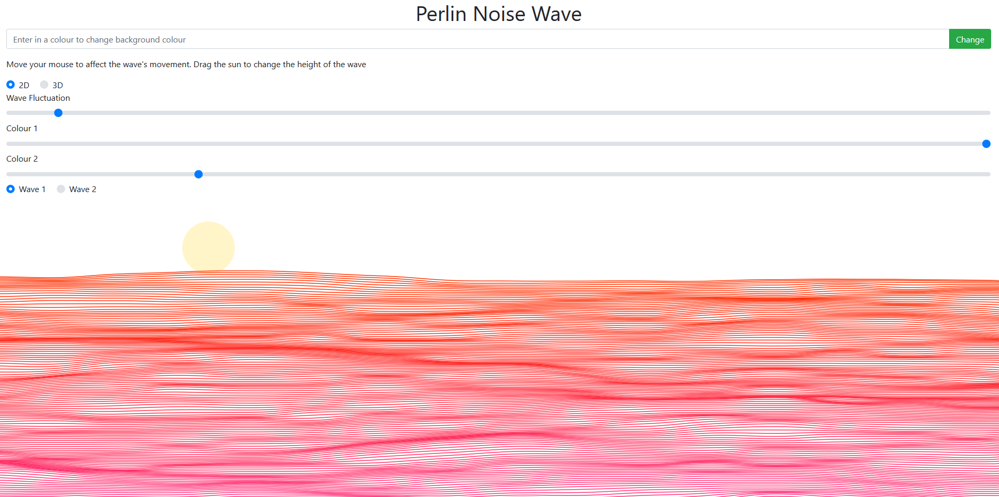
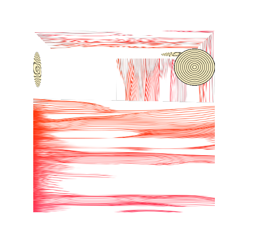
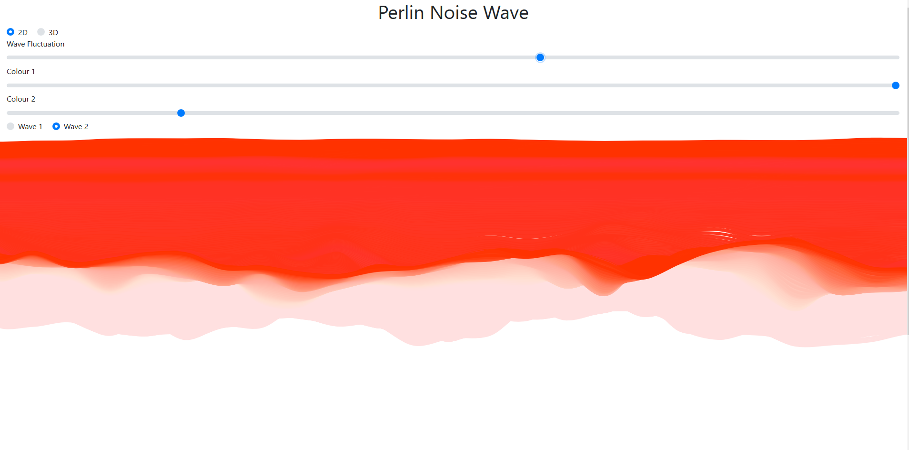
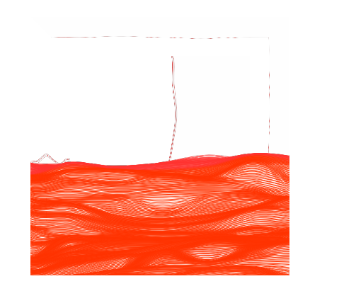

# Perlin Noise Wave

This is a fork off [Perlin Noise Wave](https://www.openprocessing.org/sketch/576489)

## Index.js
The index.js file will be the first thing to run and choose what is and what is not loaded onto the webpage. 

#### Setup function
```javascript
function setup() {
    if (viewFlag == 1){
        createCanvas(windowWidth, windowHeight);
    }
    else if ( viewFlag == 2){
        createCanvas(windowWidth, windowHeight, WEBGL);
        g = createGraphics(450, 500);
    }

    // Create new wave objects, w1 for wave option 1 and w2 for wave option 2
    w1 = new Control();
    w2 = new Control();
}
```
This will create an object for both Wave option 1 and for Wave option 2 separately. The viewFlag will either create a normal canvas if the 2D radio button is selected and a WEBGL renderer is the 3D radio button is selected.

#### Draw function
```javascript
function draw() {

    // Check if user has changed to different wave option
    changeWave();
  
    // Flag = 1 draws Wave option 1
    if (flag == 1) {
        w1.setColours(document.getElementById('colour1').value, document.getElementById('colour2').value);
        w1.getSlidervalue(document.getElementById('waveWidth').value);
        w1.getFlagValue(flag);
        w1.draw(g);
    }

    // Flag = 2 draws Wave option 2
    if (flag == 2) {
        w2.setColours(document.getElementById('colour1').value, document.getElementById('colour2').value);
        w2.getSlidervalue(document.getElementById('waveWidth').value);
        w2.getFlagValue(flag);
        w2.draw(g);
    }
}
```
The draw function will select either Wave option 1 or 2 to call the draw function within the Control class. This way prevent both being drawn at the same time. changeWave() will always be looking to see if the radio button selection has been swapped. If so, it will make the draw() function draw the other wave.

#### Getting HTML values
```javascript
// Hides HTML elements that are not useable in Wave option 2
function hide(){
    document.getElementById('hide').style.display ='none';
}

// Shows HTML elements that are useable in Wave option 1
function show(){
    document.getElementById('hide').style.display = 'block';
}

// Gets radio buttons with name 'wave' and finds which one is selected and gets its value
function changeWave(){
    var radios = document.getElementsByName('wave');
    for (var i = 0, length = radios.length; i < length; i++) {
        if (radios[i].checked) {
            flag = radios[i].value;
            break;
        }
    }
}

// Gets radio buttons with name 'webgl' and finds which one is selected and gets its value
function changeView(){
    var viewRadios = document.getElementsByName('webgl');
    for (var j = 0, length = viewRadios.length; j < length; j++) {
        if (viewRadios[j].checked) {
            viewFlag = viewRadios[j].value;
            setup();
            break;
        }
    }
  
}
```
**Hide()** and **Show()** will hide the change background colour option for Wave 2 and show it for Wave 1 respectively. I have chosen to add these in to prevent confusion if the user tries to change the background on Wave 2 as it is not possible without it ruining the waves.
The **changeView()** and **changeWave()** functions changes the sketch between 2D and 3D, and changes which wave option is picked respectively. This is done by looking for element names and finding which radio button with the corresponding name is currently checked and getting its value.

## Control Class
The Control class is used to create Wave option 1, Wave option 2 and the Sun. 
#### Constructor
```javascript
constructor() {
this.sunX  =  400;
this.sunY  =  100; 
this.offset  =  300; 
this.waveSpeed  =  0.0;
this.sun  =  new  Sun(this.sunX, this.sunY);
this.noiseVal  =  random(200);
this.bgColour  =  'white';
this.ofs  =  0;
this.ofsV  =  1;
}
```
The constructor creates all default variables required in the Control class. 

- **sunX and sunY** define the default sun position
- **this.sun** automatically creates a new Sun with position sunX and and sunY. sunX and sunY are separately defined as they need to be accessed elsewhere
- **offset, waveSpeed, noiseVal, ofs, ofsV** are used for the waves movement and change in height
- **bgColour** defaults the background colour to white

#### Getters and setters
``` javascript
// Set value of colours from sliders
setColours(colour1, colour2) {
this.sliderColour1  =  colour1;
this.sliderColour2  =  colour2;
}
// Get value of Wave fluctuation slider
getSlidervalue(sliderxValue) {
this.sliderxValue  =  sliderxValue;
}
// Get value of background colour from HTML form
setColour() {
this.bgColour  =  document.getElementById('colour').value;
}
// Get value of flag to choose which wave to draw
getFlagValue(flag) {
this.flag  =  flag;
}
```
These are getters and setters used to retrieve and set variables affected by HTML elements including the sliders, radio buttons and submit button.
#### Draw function
```javascript
   draw(g) {
        if (g) {
            this.drawRender(g);
        } 
        else {
            this.drawCanvas();
        }
}
```
The draw function will run when it is called from the draw() function within index.js. It will select either the renderer or the canvas option depending on if g (the graphics renderer) is selected.

```javascript
    drawCanvas() {

        if (this.flag == 1) {
            background(this.bgColour);
            strokeWeight(0);
            this.sun.createSun();
            noFill();
            strokeWeight(1.5);
            this.waveSpeed += 0.015;
            this.waveH = map(this.sliderxValue, 0, width, 100, 500);

            for (this.waveNum = this.sun.sunY + 10; this.waveNum < height; this.waveNum += 3) {
                this.wave1 = new Wave(this.sun.sunY + 10, this.noiseVal, this.waveSpeed, this.waveNum, this.waveH, this.sliderColour1, this.sliderColour2);
                this.wave1.drawLine();
            }
        }

        if (this.flag == 2) {
            translate(0, -200);
            this.ofs += this.ofsV;
            if (this.ofs == this.offset || this.ofs == 0) {
                this.ofsV = 0 - this.ofsV;
            }
            strokeWeight(6);
            this.wave2 = new Wave2(this.sliderxValue);
            this.wave2.drawLine2(212 + this.ofs, this.sliderColour1, this.sliderColour2);
            this.wave2.drawLine2(215 + this.ofs, this.sliderColour1, this.sliderColour2);
            strokeWeight(1);
            this.wave2.drawLine2(210 + this.ofs, this.sliderColour1, this.sliderColour2);

        }
    }
 ```
 The drawCanvas is one of the options that can be selected from the draw function. As the Control class has already retrieved the flag, it will check which wave option the user has selected. If it is '1' then it will pick wave option 1 and '2' for wave option 2. Wave 1 is the only option that can interact with the sun as Wave 2 does not redraw the background every frame. Under each choice, the waves are drawn by calling each function specific to each wave. Wave 1 passes in the Suns Y position so that the Sun can interact with the waves. Both pass in the slider colours to affect the waves' colour as they are drawn.

## Wave Class
This is the first wave option that has  indistinguishable lines. 


3D renderer


#### Constructor
```javascript
    constructor(yVal, noiseVal, waveSpeed, waveNum, waveH, colour1, colour2) {
        this.yVal = yVal;
        this.noiseVal = noiseVal;
        this.waveSpeed = waveSpeed;
        this.waveNum = waveNum;
        this.waveH = waveH;
        this.colour1 = colour1;
        this.colour2 = colour2;
    }
```
The constructor sets all the values required by the wave to make it e.g. change its height and affecting the colour.

- **yVal** affects the height of the wave, which is passed from the location of the Sun's Y value
- **noiseVal** changes the noise of the wave
- **waveSpeed** changes the speed of the wave
- **waveNum** is the number of waves drawn
- **colour1** and colour2 are passed from the sliders retrieved from the Control class

#### drawLine function

```javascript
   drawLine(g) {

        if (g) {
            this.render = createGraphics(windowWidth, windowHeight);
            this.render.beginShape();
            this.render.stroke(this.colour1, this.colour2, map(this.waveNum, this.yVal, height, 0, 255));
            this.x = 0;
            this.y = this.waveNum + (this.waveH * noise( mouseX / 1000, (mouseY / 100) + (this.waveNum * 0.01), this.noiseVal + this.waveSpeed));
            this.render.curveVertex(this.x, this.y);
            
            for (this.w = 0; this.w <= width; this.w += 20) {
                this.x = this.w;
                this.y = this.waveNum + (this.waveH * noise( (mouseX / 1000) + (this.w * 0.001), (mouseY / 100) + (this.waveNum * 0.01), this.noiseVal + this.waveSpeed));
                this.render.curveVertex(this.x, this.y);
            }
            this.x = width;
            this.y = this.waveNum + (this.waveH * noise( (mouseX / 1000) + width, (mouseY / 100) + (this.waveNum * 0.01), this.noiseVal + this.waveSpeed));
            this.render.curveVertex(this.x, this.y);
            this.render.endShape();
      
            // Render an image once the waves are drawn
            g.image(this.render, 0, 0);
        }
   
        else {
            beginShape();
            stroke(this.colour1, this.colour2, map(this.waveNum, this.yVal, height, 0, 255));
            this.x = 0;
            this.y = this.waveNum + (this.waveH * noise( mouseX / 1000, (mouseY / 100) + (this.waveNum * 0.01), this.noiseVal + this.waveSpeed));
            curveVertex(this.x, this.y);

            for (this.w = 0; this.w <= width; this.w += 20) {
                this.x = this.w;
                this.y = this.waveNum + (this.waveH * noise( (mouseX / 1000) + (this.w * 0.001), (mouseY / 100) + (this.waveNum * 0.01), this.noiseVal + this.waveSpeed));
                curveVertex(this.x, this.y);
            }
            this.x = width;
            this.y = this.waveNum + (this.waveH * noise( (mouseX / 1000) + width, (mouseY / 100) + (this.waveNum * 0.01), this.noiseVal + this.waveSpeed));
            curveVertex(this.x, this.y);
            endShape();
        }
    }
}
```
This is the drawLine function that creates and displays the waves. Firstly, it will check if a renderer is available. If so, it will pick the rendering option. The rendering option and the canavas option are similar except the renderer uses **createGraphics** instead. It will being the shape by changing the stroke of the waves. Afterwards, the x and y values are defined and changed within a for loop. Within the for loop, a new line is generated. Multiple lines are created in order to create the affect of the wave. After all of the waves are created and drawn, the shape as a whole is closed as there is no need to create anything else. 
The only big difference between the renderer and the canvas option is that the renderer will create an image of the render at the end while the canvas option will directly draw it to the canvas. 

## Wave 2 Class
This is the second wave option that has no indistinguishable lines. 


3D renderer


#### Constructor

```javascript
class Wave2 {
    constructor(sliderxValue) {
        this.step = 80;
        this.noiseScale = 0.02;
        this.offset = 300;
        this.sliderxValue = sliderxValue;
    }
```
This constructor will only pass in the sliderxValue which is the 'Wave Fluctuation' slider. All the other values are set initially within the constructor.

- **step** will be how many times the for loop will step through and create a 'curveVertex'.
- **noiseScale** will change how noisy the wave becomes (how much the waves go up and down)
- **offset** this is used in conjunction with **noiseScale** to modify how much noise is created
- **sliderxValue** is set from the 'Wave Fluctuation' slider retrieved by the Control class.
#### drawline2 function
```javascript
    drawLine2(y0, colour1, colour2, g) {
    
        if (g){
            this.renderer(y0, colour1, colour2, g);   
        }
        else {
            this.canvas(y0, colour1, colour2, g);
        }
    }
```
The drawLine2 script will pick either the renderer or the canvas function depending on if a renderer is picked from the radio buttons in the HTML form.
#### Renderer and Canvas function
```javascript
    renderer(y0, colour1, colour2, g){
        this.render = createGraphics(windowWidth, windowHeight);
        this.render.fill(255, 4);
        this.render.beginShape();
        this.render.curveVertex(-50, y0);
        for (var i = 0; i < (width / this.step) + 5; i += 1) {
            var noiseVal = noise(i * this.noiseScale * y0 * 0.06, frameCount * this.noiseScale);
            this.render.stroke(colour1, colour2, map(5, mouseY, height, 0, 255));
            this.render.curveVertex( (i * this.step) - 10, y0 + ((noiseVal * this.offset) * (this.sliderxValue/1000)));
        }
        this.render.curveVertex(width + 10, height + 200);
        this.render.curveVertex(0, height + 210);
        this.render.curveVertex(0, height + 210);
        this.render.endShape();
      
        // Create image of render
        g.image(this.render, 0, 0); 
    }

    canvas(y0, colour1, colour2, g){
        fill(255, 4);
        beginShape();
        curveVertex(-50, y0);
        for (var i = 0; i < (width / this.step) + 5; i += 1) {
            var noiseVal = noise(i * this.noiseScale * y0 * 0.06, frameCount * this.noiseScale);
            stroke(colour1, colour2, map(5, mouseY, height, 0, 255));
            curveVertex( (i * this.step) - 10, y0 + ((noiseVal * this.offset) * (this.sliderxValue/1000)));
        }
        curveVertex(width + 10, height + 200);
        curveVertex(0, height + 210);
        curveVertex(0, height + 210);
        endShape();
    }
}
```
Both have the same methodoloy except the **Renderer()** function will create an image at the end.
Both functions uses fill(255,4) to make the effect of the wave vanishing. They then begin the shape and create waves in the for loop with the amount generated using the **this.step** value. After the loop is finished the waves are replaced with 3 white waves that add to the effect of the wave fading away.

## Sun class
The Sun class creates a sun that is interactable only with Wave 1. This is because the sun needs to be redrawn every time it is moved and Wave 2 requires that nothing is redrawn in order to keep its affect.
#### Constructor
```javascript
// Set this.sunX and this.sunY as values passed in from Control.js
    constructor(sunX, sunY) {
        this.sunX = sunX;
        this.sunY = sunY;
    }
```
The sun only requires the X and Y values of where it will be drawn. These are passed from the Control class where the actual values are defined. 

#### createSun function
```javascript
   createSun(g) {

        if (g) {
            this.render = createGraphics(windowWidth, windowHeight);
            for (this.i = 10; this.i > 0; --this.i) {
                this.size = map(this.i, 10, 0, 100, 0);
                this.render.fill(lerpColor(color(255, 245, 200), color(255, 255, 250), (1 - this.i) / 10));
                this.render.ellipse(this.sunX, this.sunY, this.size, this.size);

                if (dist(this.sunX, this.sunY, mouseX, mouseY) < this.size / 2 && mouseIsPressed) {
                    this.sunX = mouseX;
                    this.sunY = mouseY;
                }
            }
            g.image(this.render, 0, 0);

        } 
        else {
            for (this.i = 10; this.i > 0; --this.i) {
                var size = map(this.i, 10, 0, 100, 0);
                fill(lerpColor(color(255, 245, 200), color(255, 255, 250), (1 - this.i) / 10));
                ellipse(this.sunX, this.sunY, size, size);

                if (dist(this.sunX, this.sunY, mouseX, mouseY) < size / 2 && mouseIsPressed) {
                    this.sunX = mouseX;
                    this.sunY = mouseY;
                }
            }
        }
    }
  ```
  The **createSun** function will place a sun above the wave. It can either be rendered or drawn onto the canvas like the other classes. 
 The sun is interactable with the mouse and it can be dragged. It does this by checking where the mouse is currently located. If it is located inside the sun (by comparing the distances) then it will allow the sun to be moved to wherever the mouse moves while "mouseIsPressed"

## HTML example
The inputs (radio, sliders and submit button) are handled via boostrap. The webpage has interactable objects which are explained with some text 
#### Scripts
```HTML
  <!-- event Listeners that will look for clicks on radios or buttons and call the coressponding function within index.js -->
  <script>
  <!-- shows background option for wave1 -->
    document.getElementById("wave1").addEventListener("click", function() {
      show();
    })
  <!-- hides background option for wave2 -->

    document.getElementById("wave2").addEventListener("click", function() {
      hide();
      setup();
    })
  <!-- set background colour when user inputs colour -->

    document.getElementById("bg").addEventListener("click", function() {
      Wave1.setColour();
    })
  </script>
  ```
  The eventListeners are there to check if any inputs are changed as they will have an effect on what is show. Each one will call a function within the index.js file and from there will propagate and effect what is displayed.
  

